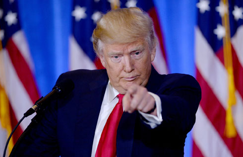
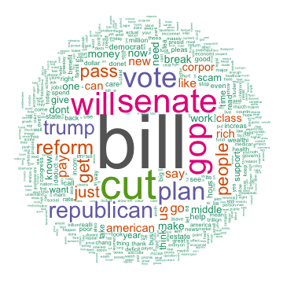
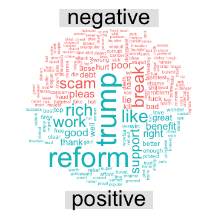

615 Final Project: Analysis of Twitter with "Tax"
========================================================
author: Yuetian Sun
date: December 15, 2017
autosize: true

Introduction
========================================================
As we all know that President Trump has published a policy about reformation of tax these days. This policy has significant effect on thousands of people’s life. This project aims to extract useful information when people twittering about tax finding out what people atitudes are and what they are most concerned about. This project is devided into several parts:

- 1 Data Cleaning and Exploratory Data Analysis
- 2 Emoji Analysis
- 3 Text Analysis
- 3.1 Topic Modeling
- 3.2 Sentiment Analysis
- 4 Conclusion

1 Data Cleaning and Exploratory Data Analysis
========================================================

We use R making connection to Twitter and randomly select 47474 twitters with "tax" from 11/24/2018 to 12/04/2018. We would like to figure out the general situation about twittering with "tax"" across the US. Thus, we make a point plot and density plot on maps to have a first impression.

1 Data Cleaning and Exploratory Data Analysis
========================================================

<small>The plots show that people in the east coast and middle north part of America twitter more about "tax"", which means in some sense they are more concerned about tax issue. We can guess that may be the east coast has lots of school and has large population. The reformation of tax will have significant effect on this area. And people in north middle parts don’t have very high salary on average and the reduction of individual income tax can help them have better life.</small>

2 Emoji Analysis
========================================================

<small><small>Now Let us take a look of what emojis people would like to twitter about "tax". First of all, we need to clean the dataset and extract the emojis (emojis code) from the twitter we selected. Then by pairing the emojis code with emojis dictionary and emojis picture, we can get the original emojis. Here is the frequency table of the ten most commonly used emojis.</small></small>

|name                               | dens| count| rank|
|:----------------------------------|----:|-----:|----:|
|money bag                          |  7.5|   355|    1|
|black small square                 |  5.9|   278|    2|
|chart with downwards trend         |  4.8|   228|    3|
|fuel pump                          |  4.8|   227|    4|
|hospital                           |  4.8|   227|    5|
|graduation cap                     |  4.8|   226|    6|
|face with tears of joy             |  4.3|   205|    7|
|white down pointing backhand index |  2.3|   107|    8|
|exclamation question mark          |  1.9|    92|    9|
|high voltage sign                  |  1.7|    79|   10|

2 Emoji Analysis
========================================================
Here is the frequency plot:

The most frequently used emoji is money bag. This make sense because tax directly related to money and this should be the thing people most concerned about. The third emoji is chart with downwards trend. It may be a negative one used to express their life going down or it may be a positive one used to express the tax reduction. Also the fourth to sixth shows people concern about hospital fee, tuition fee and many other fee related to tax policy.

2 Emoji Analysis
========================================================

<small>The next step is to compare emoji frequency between two different subsets of the data. There are multiple pairs of words you can choose as second keywords. Let’s use "Trump" and "cut" as an example.</small>

|name                     | dens.1| dens.2| freq.1| freq.2| dens.mean| logor|
|:------------------------|------:|------:|------:|------:|---------:|-----:|
|face with tears of joy   |    2.4|    0.9|    115|     44|      1.65|  0.95|
|high voltage sign        |    0.7|    0.3|     34|     15|      0.50|  0.78|
|person with folded hands |    0.1|    0.1|      6|      3|      0.10|  0.56|
|police cars light        |    0.3|    0.3|     15|     12|      0.30|  0.21|
|regional indicator       |    0.1|    0.2|      5|      9|      0.15| -0.51|
|thumbs up sign           |    0.1|    0.1|      3|      6|      0.10| -0.56|
|pouting face             |    0.1|    0.1|      3|      7|      0.10| -0.69|
|regional indicator       |    0.1|    0.6|      4|     27|      0.35| -1.72|
|christmas tree           |    0.0|    0.4|      2|     18|      0.20| -1.85|
|money bag                |    0.3|    2.4|     12|    114|      1.35| -2.18|

2 Emoji Analysis
========================================================

As we can see above, when people mention "Trump" in twitter with "tax", they tends to use face with tears of joy while people mention “cut” are more likely to use money bag. In additon, people who mention "cut" or "trump" are equal likely to use person with folded hands. May be they use it to hope for the good life. After exploring the emojis, we now focus on the text part of twitters.

3 Text Analysis
========================================================
Now let us take a look of what words people would like to use when twittering with "tax". We make a table and a frequency plot of words showing up more than 1500 times.

From the bar plot above, we can find that people are concerning about cuting their bill, republican and voting things about tax. These make sense because the reducation tax policy is passed in senate and is comed up Trump, repulican party. And the aim of these policy is to cut the tax and promote American’s life.

3.1 Topic Modeling
========================================================
<small><small><small>To take a further step, we conduct Topic Modeling and analyze what topic people will talk when twittering about tax. Topic Model is a type of statistical model for discovering the abstract "topics" that occur in a collection of documents.In this report, we focus on using LDA to conduct Topic Model. And we would like to choose Gibbs Sampling. The result topics are as follow:</small></small></small>

|Topic 1  |Topic 2 |Topic 3  |Topic 4    |Topic 5 |Topic 6 |Topic 7 |
|:--------|:-------|:--------|:----------|:-------|:-------|:-------|
|will     |cut     |get      |gop        |new     |like    |pay     |
|year     |rich    |just     |plan       |time    |can     |people  |
|think    |corpor  |now      |trump      |state   |one     |class   |
|estatee  |break   |need     |republican |back    |know    |money   |
|people   |give    |right    |presid     |america |read    |work    |
|busi     |wealthi |realli   |show       |today   |see     |middle  |
|increas  |benefit |congress |parti      |chang   |good    |dont    |
|deficit  |rate    |talk     |claim      |great   |even    |want    |
|everi    |job     |stop     |win        |govern  |look    |say     |
|trillion |big     |well     |never      |live    |thing   |make    |

3.1 Topic Modeling
========================================================

Here is how we indicate the result:

As we can see from the above table, this is the 7 topics people would like to talk about when twittering tax. Now let’s indicate the first three topics. we can find that topic 1 contain words like "rich", "poor", "middle" and "class". Thus we can make an assumption that people care about how tax affects on different classes. The second topic has "Trump", "reform", "thank" and "lie" in it. Thus we can indicate that this may relate to topic President Trump and reformation of tax. In the third part, we have words "vote", "people", "support" and "follow". Therefore, we can view the third topic as people supporting degree on tax reduction.

3.2 Sentiment Analysis
========================================================

Now let’s take a look on what people’s attitude on tax by conducting sentiment analysis. To start with, let us see what words people use to express their emotion. We can choose emotion like joy, angry, disgust. Here we only show joy as an example.

|     |w1   |w2  |w3    |w4   |w5   |w6   |w7    |w8   |w9   |w10  |
|:----|:----|:---|:-----|:----|:----|:----|:-----|:----|:----|:----|
|word |vote |pay |money |good |save |hope |child |love |deal |true |
|n    |2193 |976 |719   |424  |243  |190  |170   |134  |122  |114  |

As we can see from the above table, the most frequently used joyful words are "vote", "pay", "money" and "good". Thus, we can guess that people with positve opinion about "tax" are likely to talk about vote for the tax policy and the money things.

3.2 Sentiment Analysis
========================================================

<small>Now let’s analyze people atitude by comparing the positive and negative words.</small>

<small>As we can see from the positive - negative plot, the lines above horizontal line means the positve words are more than negative words in every eighty twitters. This graph show that the case positive words is more than negative happens more than the other case. That is to say, the number of positive words is larger than the number of negative words. Thus we can indicate that the on the average people show positive atitude when talking about tax. </small>

3.2 Sentiment Analysis
========================================================

<small>We now interested in what most frequently positive and negative words people used.</small>

<small>People would likely to use positive words like "reform", "trump" and "rich". We can indicate that people tend to believe the reformation of tax published by Trump can help people become rich, wealthy. But as we can also find that some people use negative like "scam", "poor" and "break". Thus, although lots of people support the policy, there are some people think it is a scam and will make people poor.</small>

3.2 Sentiment Analysis
========================================================

<small>To have a more intuitive way of the words and its frequency, I make word clouds of top 500 frequently used words and top 200 positive, negative words.</small>

<small>It is very clear that people concern about the about bill and money stuff most and then they also care about the policy itself. Besides, people with positive attitude would likely to think about the reform of tax will make them rich while people with negative attitude think the reduction of tax is a scam.</small>

Conclusion
========================================================

<small><small>In this project, we care about how people think about the tax through twitter. We find that people living in east coast and north middle part show more concern about tax. Besides, by analyzing the emojis, we figue out that people are most concerned about money stuff. They care about hospital fee, tuition fee and many other fee related to tax policy. To narrow down, we use “trump” and “cut” as our second keywords. When people mention “trump” in twitter with “tax”, they tend to use face with tears of joy while people mention “cut” are more likely to use money bag. For the text part, from the bar plots, word clouds and tables, we can find that people are concerned about cuting their bill, republican and voting things about tax. And by conducting Topic Modeling, we find that people would likely to talk about how tax affects on different classes, President Trump and reformation of tax, and supporting degree on tax reduction. Additionaly, by conducting the Sentiment Analysis, we find that people show more postive attitude when twittering about tax and they tend to believe the reformation of tax can bring people good life.
To sum up, when twittering about tax, people are most concerned about the reduction policy and how it affect their money and their life. In general, although some people think this policy is a scam, lots of people do believe this reformation will make them wealthy and they support Trump policy of cuting tax.</small></small>
